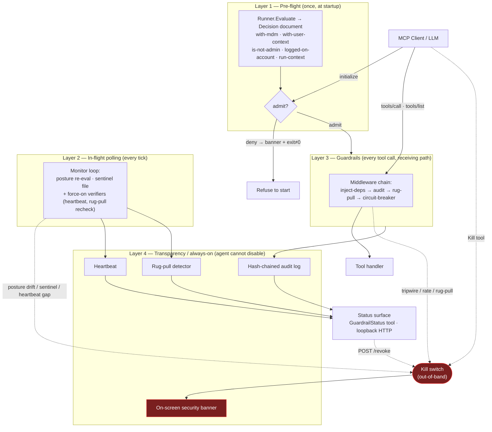
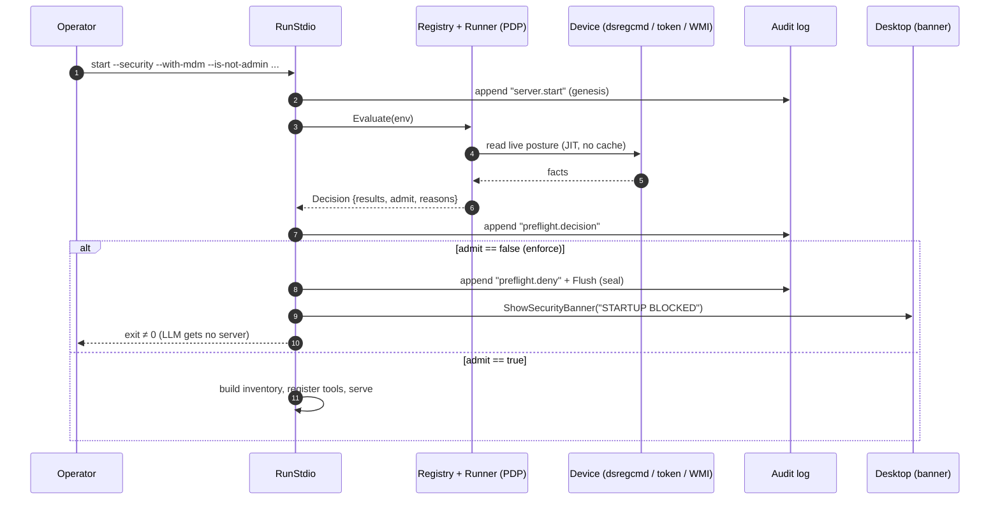
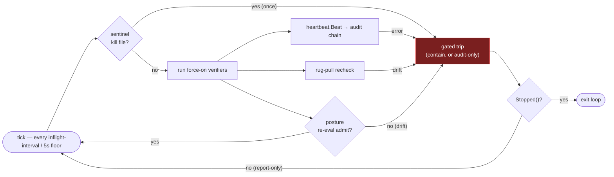
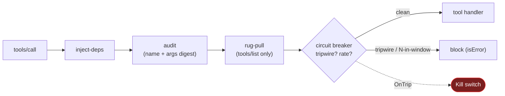
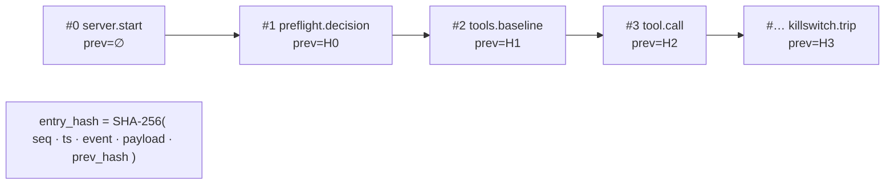
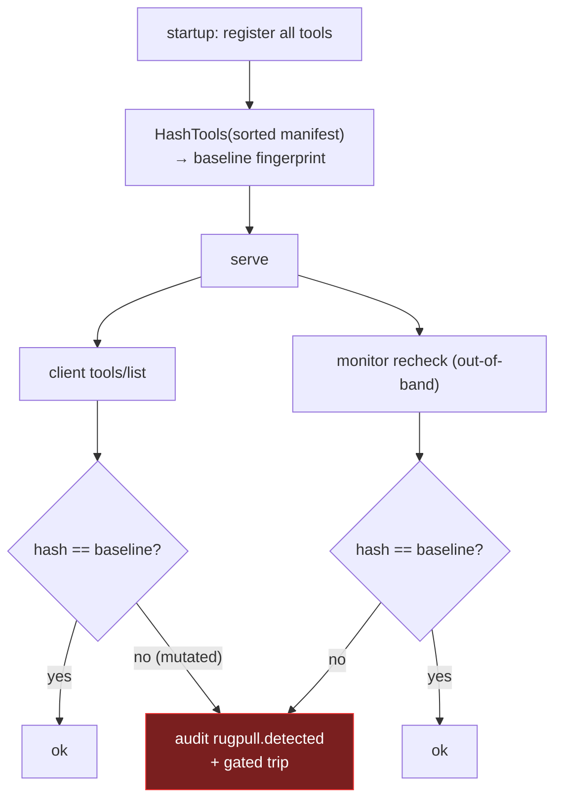
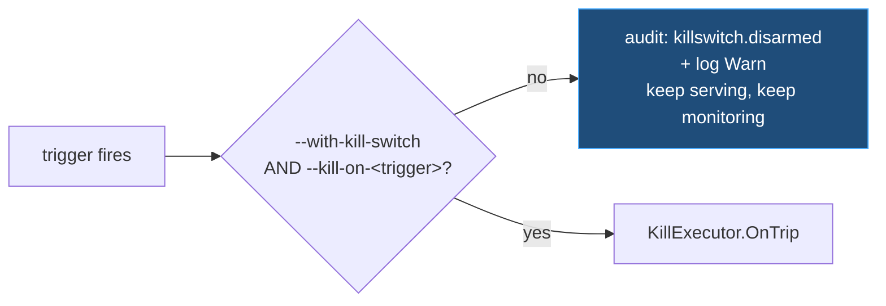
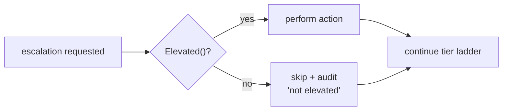
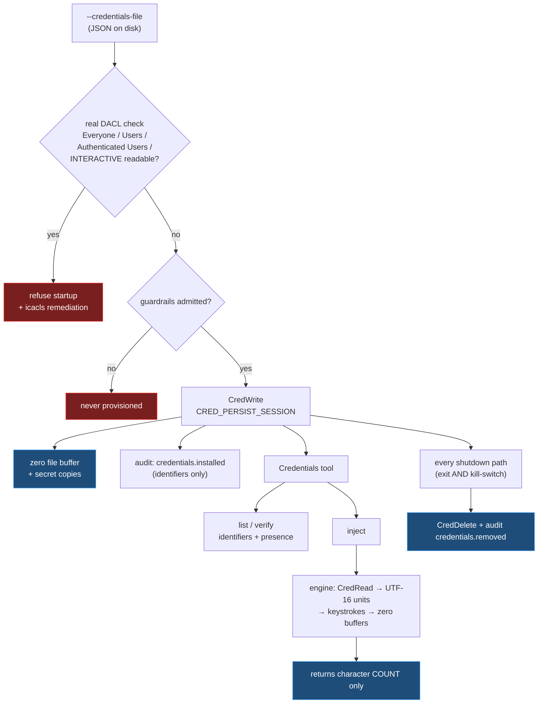

# Security Architecture

`windows-mcp-server` hands a non-deterministic LLM real control over a Windows
desktop — UI automation, PowerShell, the registry, processes, the filesystem.
For managed use it therefore **gates and contains itself**. The security model
is organized into **four layers** plus an out-of-band **kill switch**, all
enforced on the server's *receiving* path so the agent cannot bypass or disable
them.

Turn the whole model on with `--security`; then opt into specific checks, kill
triggers, and kill actions. `--security` forces `enforce` mode and force-enables
every transparency service.

> **Scope.** This document describes the design. For the flag reference and a
> quick start, see the [Security section of the README](../README.md#security--four-layers).
> The local checks are **auditable defense-in-depth, not a hard boundary** — see
> [Trust model](#trust-model).

---

## The four layers at a glance

**Policy-decision / policy-enforcement split (PDP/PEP).** A `Runner` (the PDP)
evaluates pluggable checks into a single **decision document**. Enforcement
points (the PEPs) act on it: the startup gate (Layer 1), the tool-call
middleware (Layer 3), and the periodic monitor (Layer 2).

---

## Layer 1 — Pre-flight (startup admission)

Pre-flight checks are evaluated **once**, before the MCP server serves anything.
A failure in `enforce` mode refuses to start (exit ≠ 0) — the LLM never gets a
usable server. Any pre-flight flag implies `enforce`.

| Check | Flag | Passes when |
|---|---|---|
| MDM enrolled | `--with-mdm` | `dsregcmd` reports an `MdmUrl` |
| Interactive user | `--with-user-context` | not SYSTEM and not Session 0 |
| Not a local admin | `--is-not-admin` | `IsUserAnAdmin()` is false |
| Logged-on account | `--with-logged-on-account=<regex>` | the interactive user matches the regex |
| Extra posture | `--guardrail <id[=arg]>` | e.g. `secure-boot`, `bitlocker`, `vbs`, `device-allowlist=<path>` |

`windows-mcp-server check` runs exactly this evaluation once and prints the
decision document (exit 2 if not admitted) — a posture dry-run for operators and
CI.

---

## Layer 2 — In-flight polling

Continuous verification: on every tick the monitor re-evaluates device posture,
watches a `kill` sentinel file, and runs the **force-on verifiers** (heartbeat +
rug-pull recheck). None of it is exposed as an agent-controllable tool; the
interval only tunes cadence (5 s floor).

Each detection routes to its **own gated trip function** (see
[Arming](#arming--a-two-step-gate)), so the four triggers arm independently. The
loop continues unless the trip was real — a report-only trip must not end
monitoring.

---

## Layer 3 — Guardrails (inline tool-call policy)

Every `tools/call` and `tools/list` passes through receiving middleware, applied
outermost-first. Because it runs on the server's receiving path, the agent
cannot remove it.

The circuit breaker (`--circuit-breaker`, auto-on in `enforce`) rate-limits
sensitive tools (PowerShell/Registry/Process/Service/FileSystem/App) over a
sliding window and trips immediately on **destructive tripwires** — attempts to
disable Defender, the firewall, or BitLocker, or to clear MDM enrollment.

---

## Layer 4 — Transparency / always-on

These services are force-on under `--security` and are **never exposed as
tools**, so a "bout of madness" cannot switch them off.

### Hash-chained audit log

Every action and security event is an append-only entry that commits to the
previous entry's hash. Any edit, insertion, deletion, or reorder breaks the
chain and is caught by `VerifyChain`. Tool calls record the tool name and a
**SHA-256 digest of the arguments** — never the raw arguments, which may carry
secrets.

`--with-logging` selects the sink: empty/`stderr` → JSON lines on stderr; a path
→ append-only JSONL, fsync-ed on flush (so the chain survives an abrupt kill).

### Heartbeat

Periodic chained entries (`--heartbeat-interval`) prove liveness. An external
watcher polling the status snapshot, or an in-process watchdog independent of the
monitor loop, detects a gap and can trigger a kill.

### Rug-pull detection

A "rug pull" is an approved server mutating its advertised tools after deployment
— adding/removing/renaming tools, or silently changing descriptions or schemas —
to smuggle unauthorized behavior past the initial approval.

The server also sets `Capabilities.Tools = {}` so a silent
`notifications/tools/list_changed` cannot quietly re-advertise a mutated set.

### On-screen security banner

Any security event raises a persistent, full-width red banner drawn on-screen
(GDI text on a layered window) — visible to a human and **captured by the
session recording**, so the event is on the video timeline.

---

## Kill switch — tiered, out-of-band

Triggers are configured **separately** from actions.

### Arming — a two-step gate

`--with-kill-switch` is the master gate (default **off**). Each trigger
additionally honours its own flag — `--kill-on-posture-drift`,
`--kill-on-circuit-trip`, `--kill-on-rugpull`, `--kill-on-heartbeat-gap` — all of
which default on, so arming the master enables the full set. The sentinel file
and `POST /revoke` are gated on the master switch alone.

**Detection is never gated.** A trigger that fires while disarmed is still
detected, logged at Warn, and written to the audit chain as `killswitch.disarmed`
with the trigger and reason. Layer 4 transparency does not depend on Layer 4
containment: the operator always sees that something fired, even when they chose
not to act on it. Critically, a report-only trip does **not** end the in-flight
monitor loop — disarming one trigger must not silently disable all subsequent
monitoring (`MonitorConfig.Stopped` gates loop exit, and only a real trip sets it).

### The ladder

Once armed, every trip **always** raises the banner, seals the audit log,
finalizes the recording, and aborts the session. The order is deliberate: seal
and finalize the forensic trail **before** any shutdown.

**Default once armed = isolate + abort, no shutdown.** On exit, network isolation
is undone (the executor keeps a `restore` handle).

### The agent-facing `Kill` tool is not an authoritative trigger

`Kill` is deliberately absent from the ladder above. It always stops the session
cleanly — `KillExecutor.StopGracefully`: audit `session.stop`, seal the chain,
finalize the recording, abort — but it actuates the containment ladder only when
the master switch is armed. Containment exists to contain *the agent*, triggered
by the authoritative detectors; letting the agent self-trigger firewall isolation
or a shutdown would be a denial-of-service vector, not a protection.

### Privilege model — best-effort degrade

The server runs in the (non-admin) user context. The elevation-only actions
(isolate / kill-procs / shutdown) run only when the process is actually elevated;
otherwise they are **skipped and audited** (`killaction.skip … not elevated`)
while the banner, log-seal, recording-finalize, and abort still happen.

---

## Credentials — use without disclosure

Credentials supplied at init (`--credentials-file`) are installed into the running
user's Windows Credential Manager. The threat this design addresses is **secret
disclosure to the model**: an agent that can read a password can leak it into a
transcript, a log, a tool argument, or an outbound request.

The load-bearing properties:

| Property | How it is enforced |
|---|---|
| The agent can never read a secret | The tool has no `get` mode, and no function in `internal/desktop` returns a secret — `readSecretUnits` returns UTF-16 code units, not a string. A test pins the mode set. |
| Secrets never reach the audit chain | `credentials.installed`/`credentials.removed` carry name, target, username, class. The tool-call audit middleware hashes arguments, and arguments only ever contain a credential *name*. |
| Secrets never reach argv | Supply is file-only; argv is readable by any process on the machine. |
| A disclosed file fails closed | The real DACL is read (`GetNamedSecurityInfo` + ACE walk). Go's Unix mode bits are ignored — Windows synthesizes `0666`, so a mode check proves nothing. |
| No residue after a session | `CRED_PERSIST_SESSION` plus explicit `CredDelete` on normal exit *and* on kill-switch trip, via one `sync.Once`-guarded cleanup. Durable persistence is rejected, not silently overridden. |
| A blocked startup provisions nothing | Installation happens after the Layer 1 admission gate; a partial install is rolled back. |
| Injection is rate-limited | `Credentials` is in `sensitiveTools`, so the Layer 3 circuit breaker counts it. |

**Residual risk, stated plainly.** The plaintext exists in process memory between
reading the file and calling `CredWrite`. Buffers are zeroed and the JSON decoder
avoids materializing an unwipeable Go string for unescaped values, but Go's
garbage collector offers no guarantee that no copy was made. A host that can read
this process's memory can read the secrets — as it could read them from the
Credential Manager anyway. This raises the cost of casual disclosure; it is not a
defence against a compromised host.

---

## Threat model mapping

| Threat | Mechanism |
|---|---|
| **Dynamic rug pull** — approved server mutates its tool set post-deploy | Manifest fingerprint pinned at startup + `tools/list` interception + monitor recheck; silent `list_changed` suppressed → audited always, and banner + isolate + abort when armed |
| **Indirect prompt injection / data-exfil loops** | Circuit breaker rate/tripwire blocks the call → escalates to **network isolation** (cuts the exfil channel) → abort, when armed; audit records the call sequence with arg digests either way |
| **Out-of-band control / agent tampering** | Status, audit, heartbeat, monitor, and kill switch are constructed in the server, not exposed as tools; middleware runs on the receiving path — unbypassable. The only agent-facing tools are read-only `GuardrailStatus` and `Kill`, which stops the session but cannot actuate containment unarmed |
| **Silent posture drift** (Secure Boot off, BitLocker suspended, MDM removed mid-session) | In-flight monitor re-evaluates live posture every interval → audited always, kill on drift when armed |
| **Log tampering / gaps** | Hash-chained append-only audit + heartbeat; `VerifyChain` detects any break |
| **Credential disclosure to the model** | The `Credentials` tool has no read mode and no engine function returns a secret; `inject` types it and returns only a character count. Secrets never reach argv, tool results, or the audit chain |
| **Data exposure over plaintext HTTP** | `--enforce-https` (forced on by `--security`) refuses `http://` for `Scrape`, for a URL-shaped `App` launch that would open the browser, and for the may-run endpoint. Scheme matching is case-insensitive. Does **not** intercept navigation inside an already-open browser — that needs a device proxy |

---

## Trust model

The local pre-flight and posture checks (`dsregcmd`, registry, WMI,
`IsUserAnAdmin`) are **auditable defense-in-depth, not a hard boundary** — a
local administrator can spoof those signals. The containment layers (circuit
breaker, kill switch, isolation) raise the cost of, and record, in-session
compromise, but they do **not** replace the OS controls you already own. Pair
this with **WDAC / AppLocker**, Conditional Access, and **code signing**.

The authoritative remote tier — Microsoft Graph device compliance (Entra +
Intune), TPM-backed attestation, and an external may-run PDP — is **parked**
behind `--enable-tier2` for later re-integration; the four-layer core never
enables it.

---

## Component / file map

| Concern | Package / file |
|---|---|
| Credential Manager engine (write/read/delete/inject) | `internal/desktop/credentials.go` |
| Credentials init loading + lifecycle | `internal/winmcp/credentials.go` |
| Credentials-file DACL check | `internal/winmcp/credfileacl_windows.go` |
| Credentials tool (list/verify/inject) | `pkg/windows/credentials.go` |
| PDP: runner, registry, decision, checks | `internal/guardrails/{runner,registry,decision,guardrail,providers,health}.go` |
| Pre-flight providers (`not-admin`, `logged-on-account`) | `internal/guardrails/providers.go` |
| Audit log (hash chain, sink, middleware) | `internal/guardrails/audit.go` |
| Heartbeat + watchdog | `internal/guardrails/heartbeat.go` |
| Rug-pull detector | `internal/guardrails/rugpull.go` |
| Circuit breaker (inline policy) | `internal/guardrails/policy.go` |
| Enforce HTTPS (URL scheme policy) | `pkg/windows/urlpolicy.go`, `internal/guardrails/remote.go` |
| In-flight monitor | `internal/guardrails/monitor.go` |
| Kill switch + tiered executor + graceful stop | `internal/guardrails/{killswitch,killaction}.go` |
| Per-trigger arming gate (`tripFunc`) | `internal/winmcp/guardrails.go` |
| System actuator (Windows / stub) | `internal/guardrails/actuator_{windows,stub}.go` |
| Firewall isolator (`INetFwPolicy2`) | `internal/guardrails/firewall_windows.go` |
| Run-context detection | `internal/guardrails/runcontext_windows.go` |
| Status surface (tool + HTTP snapshot) | `internal/guardrails/status.go` |
| On-screen security banner | `internal/desktop/overlay.go`, `com.go` |
| Wiring (RunStdio, config groups) | `internal/winmcp/{server,guardrails}.go` |
| CLI flag groups | `cmd/windows-mcp-server/main.go` |
| Tier-2 (parked) | `internal/guardrails/{graph,remote,attestation_windows}.go` |

The platform-agnostic core (audit, heartbeat, rug-pull, kill-action logic,
providers) builds and unit-tests on Linux via the `!windows` actuator stub; only
the OS-touching pieces (firewall, process kill, shutdown, token, overlay, WMI)
are Windows-tagged.
