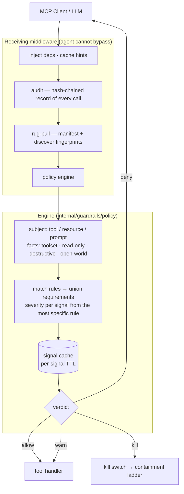
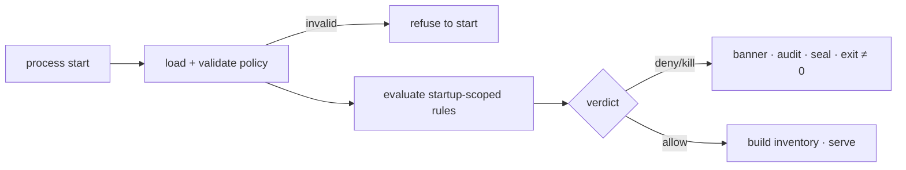
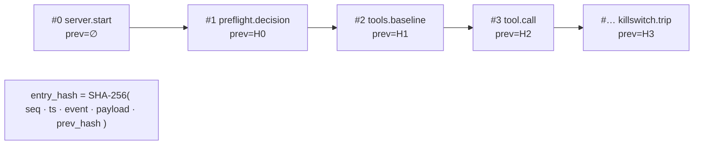
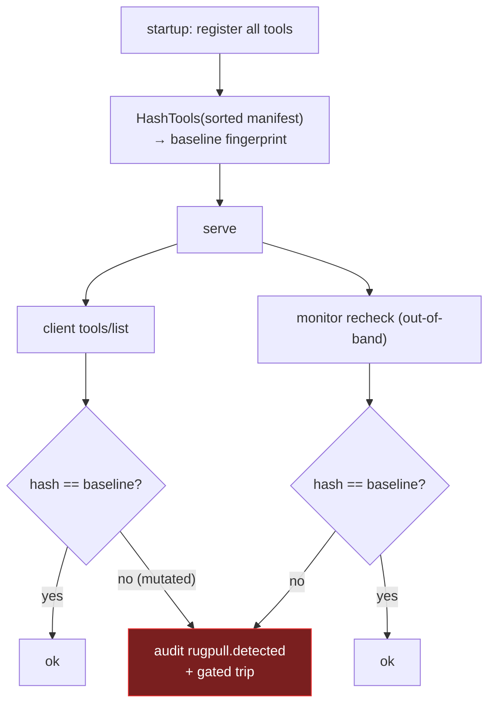
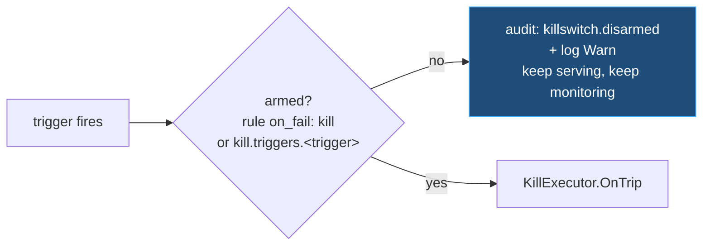
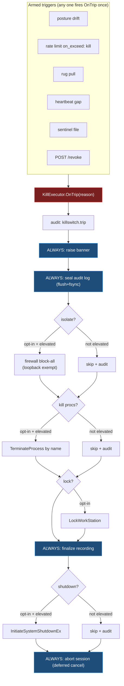
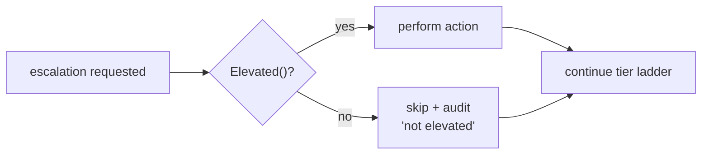
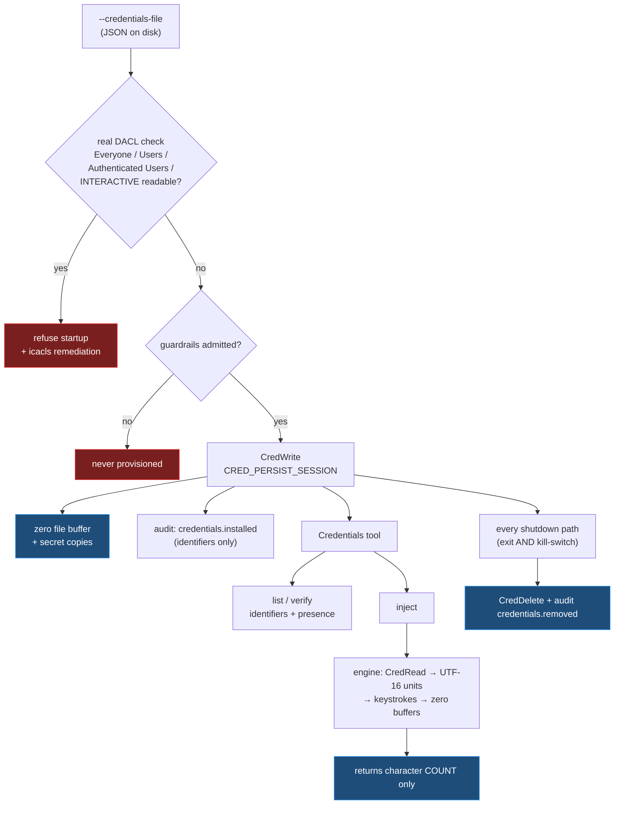

# Security Architecture

`windows-mcp-server` hands a non-deterministic LLM real control over a Windows
desktop — UI automation, PowerShell, the registry, processes, the filesystem. For
managed use it therefore **gates and contains itself**.

A **policy engine** sits between the MCP caller and the tools. Before a tool runs,
a resource is read or a prompt is fetched, it evaluates live device signals
against rules in a policy document and decides what happens. It runs on the
server's *receiving* path, innermost in the middleware chain, so the agent can
neither bypass nor disable it.

```sh
windows-mcp-server stdio --policy-config C:\ProgramData\windows-mcp\policy.json
```

With no document the built-in default applies: the engine is present, every
declared signal is evaluated and every verdict recorded, and nothing is refused.

> **Scope.** This document describes the design. For the document schema, the
> signal catalogue and the flag migration table, see
> [docs/policy-config.md](policy-config.md); for a quick start, the
> [Security section of the README](../README.md#security).
> The local signals are **auditable defense-in-depth, not a hard boundary** — see
> [Trust model](#trust-model).

---

## The decision path



Every verdict is written to the audit chain first — including allows, and
including in audit mode — so the record exists before anything acts on it.

---

## Verdicts

A rule states what happens when a signal it requires fails. The verdict for a
request is the **highest** severity among its failures, then capped by the
policy's mode.

| `on_fail` | | Effect |
|---|---|---|
| `allow` | green | Proceeds. The failure is still recorded. |
| `warn` | amber | Proceeds, and the warning is attached to the result, so the model sees it and not only the operator. |
| `approve` | held | The call is suspended on an out-of-band human decision solicited over a webhook; it proceeds only if approved, and a timeout denies. Dual control — see `docs/policy-config.md`. |
| `deny` | red | This call is refused. Nothing latches — the next call is evaluated afresh, so a signal that recovers restores service without a restart. |
| `kill` | out of bounds | The kill switch trips and the containment ladder runs. |

`mode: "audit"` caps severity at `warn`. It **caps rather than skips**: signals
are still read and every verdict is still recorded, including the `intended`
severity enforcing would have applied. That record is the whole value of audit
mode — it is how an operator sees what a policy would refuse before switching it
on. It is also the shipped default, so adopting the engine cannot break a working
deployment before its policy is written.

A refusal takes the shape the method requires. `tools/call` gets an `IsError`
result with a nil Go error, so the model can read the reason and adapt.
`resources/read` and `prompts/get` have no `IsError` envelope — their results are
`ReadResourceResult` and `GetPromptResult` — so a refusal there is a JSON-RPC
error. Answering either with a `CallToolResult` would put the wrong shape on the
wire.

---

## Rules

Rules match on what a call can actually do, so posture requirements scale with
risk rather than applying uniformly:

- `tool` — by name.
- `toolset` — by id; `"*"` matches every tool.
- `annotation` — `read-only`, `destructive`, `open-world`, from the tool's MCP
  annotations.
- `scope` — `call` (default) or `startup`.

Selectors within one match are ANDed; values within a selector are ORed.

**Requirements are the union** across every matching rule, so adding a rule can
never drop a requirement another imposed. **Severity is attributed per signal** to
the most specific rule that requires it:

```
tool  >  annotation  >  named toolset  >  toolset "*"
```

Ties break by document order, last wins. `policy explain --tool <name>` prints
exactly this attribution, evaluating nothing — so a refusal in the field is
attributable without re-running device probes, and from a different machine.

`resources/read` and `prompts/get` are decided as read-only subjects with no
toolset. A resource exposing the same desktop state as a tool must not be a way
around the rule covering that tool.

---

## Startup admission

Rules scoped `startup` are evaluated once, before any tool surface is assembled.
A refused device never gets as far as registering tools or provisioning
credentials.



A named policy that fails to load is fatal. Falling back to the default would
silently run a device under weaker policy than its operator wrote.

---

## Signal freshness

Device probes are expensive: `dsregcmd`, WMI and `tpmtool` cost hundreds of
milliseconds each, and a desktop-automation session makes many small tool calls.
Evaluating every signal per request would dominate the session.

Each signal carries a `ttl`. Readings are cached, and the in-flight monitor
refreshes expired ones in the background so staleness is bounded by
`inflight.interval` as well as by the TTL itself. `"ttl": "0s"` opts a signal into
live evaluation on every request — correct for cheap in-process signals such as
`run-context`, expensive on anything backed by a shell or WMI.

Two properties matter:

- **The cache starts unread, not passing.** A cache that began life holding a pass
  would admit the first calls of a session without having looked at the device.
- **A failing signal is not a monitor error.** `signalCache.Refresh` runs as a
  monitor `VerifyFunc`, and a `VerifyFunc` returning an error fires that check's
  kill trigger. Reporting a failing signal that way would escalate every failure
  to containment regardless of the severity its policy assigned.

Posture drift falls out of the same mechanism: a signal that flips to failing is
picked up by whichever rules require it, on the next call and by the monitor's
own re-evaluation of the startup rules.

---

## Always-on transparency

These services are configured by the policy's `transparency` block and are **never exposed as
tools**, so a "bout of madness" cannot switch them off.

### Hash-chained audit log

Every action and security event is an append-only entry that commits to the
previous entry's hash. Any edit, insertion, deletion, or reorder breaks the
chain and is caught by `VerifyChain`. Tool calls record the tool name and a
**SHA-256 digest of the arguments** — never the raw arguments, which may carry
secrets.



`transparency.audit_destination` selects the destination: empty/`stderr` → JSON lines on stderr; a path
→ append-only JSONL, fsync-ed on flush (so the chain survives an abrupt kill).

### Heartbeat

Periodic chained entries (`transparency.heartbeat`) prove liveness. An external
watcher polling the status snapshot, or an in-process watchdog independent of the
monitor loop, detects a gap and can trigger a kill.

### Rug-pull detection

A "rug pull" is an approved server mutating its advertised tools after deployment
— adding/removing/renaming tools, or silently changing descriptions or schemas —
to smuggle unauthorized behavior past the initial approval.

Four surfaces are fingerprinted, not one: **tools**, **prompts**, **resources**
and the **`server/discover` advertisement**. A mutated prompt changes the
instructions the model follows, and a mutated resource URI changes what it reads,
so both are rug-pull vectors as much as a mutated tool; `server/discover` is the
canonical statement of capabilities and instructions under 2026-07-28, so a
change there is a change to what the server claims to be. Each is pinned
separately (`HashTools`, `HashPrompts`, `HashResources`, `HashDiscover`) and a
surface with no baseline is skipped rather than treated as drift, so a server
that serves no prompts cannot trip on them.

Capabilities are pinned explicitly by `pinnedCapabilities` with `listChanged`
false. This matters: the SDK *infers* prompt and resource capabilities with
`listChanged: true` the moment one is registered, which would let a mutated
manifest be pushed to the client without it re-listing — the exact channel this
detection exists to close.



The server also sets `Capabilities.Tools = {}` so a silent
`notifications/tools/list_changed` cannot quietly re-advertise a mutated set.

### On-screen security banner

A kill-switch trip raises a persistent, full-width red banner drawn on-screen
(GDI text on a layered window) — visible to a human and **captured by the
session recording**, so the event is on the video timeline.

---

## Kill switch — tiered, out-of-band

Triggers are configured **separately** from actions.

### Arming

Two things arm the switch, both stated in the policy document.

**A rule's `on_fail: "kill"`** (or a rate limit's `on_exceed: "kill"`). Writing
that *is* the operator arming containment for that case, so it needs no second
switch. Requiring one elsewhere in the file would mean a policy that reads as
arming the kill switch quietly does not. `mode: "audit"` still caps it to a
warning, so the default can never reach here.

**The `kill.triggers` block**, for the sources that have no rule severity of their
own — `posture_drift`, `rugpull`, `heartbeat_gap`, `sentinel`. Each defaults off.

**Detection is never gated.** A trigger that fires while its switch is off is
still detected, logged at Warn, and written to the audit chain as
`killswitch.disarmed` with the trigger and reason. Transparency does not depend on
containment: the operator always sees that something fired, even when they chose
not to act on it. Critically, a report-only trip does **not** end the in-flight
monitor loop — disabling one trigger must not silently disable all subsequent
monitoring (`MonitorConfig.Stopped` gates loop exit, and only a real trip sets it).



### The ladder

Once armed, every trip **always** raises the banner, seals the audit log,
finalizes the recording, and aborts the session. The order is deliberate: seal
and finalize the forensic trail **before** any shutdown.



**Nothing is armed by default.** The shipped default policy sets every
`kill.actions` field to false, so a trip raises the banner, seals the audit log,
finalizes the recording and aborts the session — and contains nothing. Each
action is opt-in per document. When `isolate` is armed, network isolation is
undone on exit (the executor keeps a `restore` handle).

### The agent-facing `Kill` tool is not an authoritative trigger

`Kill` is deliberately absent from the ladder above. It always stops the session
cleanly — `KillExecutor.StopGracefully`: audit `session.stop`, seal the chain,
finalize the recording, abort — but it actuates the containment ladder only when
the master switch is armed. Containment exists to contain *the agent*, triggered
by the authoritative detectors; letting the agent self-trigger firewall isolation
or a shutdown would be a denial-of-service vector, not a protection.

### Privilege model — best-effort degrade

The server runs in the (non-admin) user context. The elevation-only actions
(isolate / kill-procs / shutdown) run only when the process is actually elevated;
otherwise they are **skipped and audited** (`killaction.skip … not elevated`)
while the banner, log-seal, recording-finalize, and abort still happen.



---

## Credentials — use without disclosure

Credentials supplied at init (`--credentials-file`) are installed into the running
user's Windows Credential Manager. The threat this design addresses is **secret
disclosure to the model**: an agent that can read a password can leak it into a
transcript, a log, a tool argument, or an outbound request.



The load-bearing properties:

| Property | How it is enforced |
|---|---|
| The agent can never read a secret | The tool has no `get` mode, and no function in `internal/desktop` returns a secret — `readSecretUnits` returns UTF-16 code units, not a string. A test pins the mode set. |
| Secrets never reach the audit chain | `credentials.installed`/`credentials.removed` carry name, target, username, class. The tool-call audit middleware hashes arguments, and arguments only ever contain a credential *name*. |
| Secrets never reach argv | Supply is file-only; argv is readable by any process on the machine. |
| A disclosed file fails closed | The real DACL is read (`GetNamedSecurityInfo` + ACE walk). Go's Unix mode bits are ignored — Windows synthesizes `0666`, so a mode check proves nothing. |
| No residue after a session | `CRED_PERSIST_SESSION` plus explicit `CredDelete` on normal exit *and* on kill-switch trip, via one `sync.Once`-guarded cleanup. Durable persistence is rejected, not silently overridden. |
| A blocked startup provisions nothing | Installation happens after startup admission; a partial install is rolled back. |
| Injection is rate-limited | `Credentials` is annotated destructive, so any rate limit matching that annotation covers it. |

**Residual risk, stated plainly.** The plaintext exists in process memory between
reading the file and calling `CredWrite`. Buffers are zeroed and the JSON decoder
avoids materializing an unwipeable Go string for unescaped values, but Go's
garbage collector offers no guarantee that no copy was made. A host that can read
this process's memory can read the secrets — as it could read them from the
Credential Manager anyway. This raises the cost of casual disclosure; it is not a
defence against a compromised host.

---

## Threat model mapping

This table maps each threat to the mechanism that addresses it. For the same
ground organised by **actor** — what a prompt-injected agent, a malicious client,
a local user, a local admin or a network attacker can do, and the residual risk
each leaves — see the [threat model in the README](../README.md#threat-model).

| Threat | Mechanism |
|---|---|
| **Dynamic rug pull** — approved server mutates its tool set post-deploy | Manifest fingerprint pinned at startup + `tools/list` interception + monitor recheck; silent `list_changed` suppressed → audited always, and banner + isolate + abort when armed |
| **Indirect prompt injection / data-exfil loops** | A `rate_limits` entry refuses the call once the window is exceeded and, at `on_exceed: "kill"`, escalates to **network isolation** (cuts the exfil channel) → abort, when armed; audit records the call sequence with arg digests either way. Where the exfil target is a domain, the egress allowlist refuses it outright |
| **Out-of-band control / agent tampering** | Status, audit, heartbeat, monitor, and kill switch are constructed in the server, not exposed as tools; middleware runs on the receiving path — unbypassable. The only agent-facing tools are read-only `GuardrailStatus` and `Kill`, which stops the session but cannot actuate containment unarmed |
| **High-risk action needs a human, not just a machine verdict** | A rule at `on_fail: "approve"` suspends the call on an out-of-band authoriser (an outbound webhook — no inbound listener, so the stdio-only posture holds), forwarding a digest of the call and never the raw arguments, signed with `WINDOWS_MCP_APPROVAL_KEY`. Fails closed: a timeout, an unreachable webhook or an unintelligible reply all deny. A plan step hitting the rule blocks the same way at apply time. Audited `approval.requested` → `approval.decision`/`approval.timeout` |
| **Silent posture drift** (Secure Boot off, BitLocker suspended, MDM removed mid-session) | In-flight monitor re-evaluates live posture every interval → audited always, kill on drift when armed |
| **Log tampering / gaps** | Hash-chained append-only audit + heartbeat; `VerifyChain` detects any break |
| **Credential disclosure to the model** | The `Credentials` tool has no read mode and no engine function returns a secret; `inject` types it and returns only a character count. Secrets never reach argv, tool results, or the audit chain |
| **Data exposure over plaintext HTTP** | `"enforce_https": true` refuses `http://` for `Scrape`, for a URL-shaped `App` launch that would open the browser, and for the may-run endpoint. Scheme matching is case-insensitive. Does **not** intercept navigation inside an already-open browser; the egress proxy is what covers that |
| **Egress to unapproved destinations** (including navigation inside an already-open browser) | `"egress"` runs a loopback CONNECT/HTTP proxy admitting only the declared domains. The allowlist is checked before the name is resolved, so a refused host emits no DNS query, and resolved addresses are re-checked against loopback/RFC1918/link-local before dialling, so an allowed name cannot be pointed at something internal. Enforcement tiers: `proxy-only` (advisory), `scoped` (outbound-block firewall rules on named applications — loopback stays reachable, so the proxy is their only route out), `global` (machine-wide default-deny with a service-scoped exception set for DNS, DHCP, NCSI, time, update and revocation, so the OS stays functional). Both firewall tiers require elevation and refuse to start without it; state is recorded before any change and restored on the next start after a crash |

---

## Trust model

The local pre-flight and posture checks (`dsregcmd`, registry, WMI,
`IsUserAnAdmin`) are **auditable defense-in-depth, not a hard boundary** — a
local administrator can spoof those signals. The containment layers (rate limits,
kill switch, isolation, egress enforcement) raise the cost of, and record,
in-session compromise, but they do **not** replace the OS controls you already
own. Pair this with **WDAC / AppLocker**, Conditional Access, and **code
signing**.

The authoritative remote signals — Microsoft Graph device compliance (Entra +
Intune) and an external may-run PDP — register only when their credentials are
present in the environment (`WINDOWS_MCP_GRAPH_*`, `WINDOWS_MCP_REMOTE_POLICY_TOKEN`).
They are read from the environment rather than from flags or the policy document
because they are secrets: argv is world-readable and a policy is meant to be
reviewable and checked in. TPM-backed attestation (`tpm-attested`) is local but
requires elevation.

Registering a signal only makes it available for a policy to declare — nothing is
evaluated unless a policy asks for it.

---

## Component / file map

| Concern | Package / file |
|---|---|
| Credential Manager engine (write/read/delete/inject) | `internal/desktop/credentials.go` |
| Credentials init loading + lifecycle | `internal/winmcp/credentials.go` |
| Credentials-file DACL check | `internal/winmcp/credfileacl_windows.go` |
| Credentials tool (list/verify/inject) | `pkg/windows/credentials.go` |
| Policy document: schema, loader, validation, embedded default | `internal/guardrails/policy/policyconfig.go`, `policy_default.json` |
| Signal cache (per-signal TTL, background refresh) | `internal/guardrails/policy/signalcache.go` |
| Rule matcher, verdict, rate limits, `Explain` | `internal/guardrails/policy/engine.go` |
| Enforcement middleware (the decision point) | `internal/guardrails/enforce/enforce.go` |
| Dual-control approval client (webhook, signing, polling) | `internal/guardrails/enforce/approval.go` |
| Signal registry + the signals themselves | `internal/guardrails/signals/` |
| Tool index adapter (toolset + annotations) | `internal/winmcp/guardrails.go` (`newToolIndex`) |
| Operator commands (`policy validate/check/explain`) | `internal/winmcp/policyops.go` |
| Example policies | `policy/examples/*.json` |
| Audit log (hash chain, destination, middleware) | `internal/guardrails/audit/audit.go` |
| Heartbeat + watchdog | `internal/guardrails/watch/heartbeat.go` |
| Rug-pull detector | `internal/guardrails/watch/rugpull.go` |
| Enforce HTTPS (URL scheme policy) | `pkg/windows/urlpolicy.go`, `internal/guardrails/signals/remote.go` |
| Capability pinning (suppresses listChanged) | `internal/winmcp/guardrails.go` (`pinnedCapabilities`) |
| In-flight monitor | `internal/guardrails/watch/monitor.go` |
| Kill switch + tiered executor + graceful stop | `internal/guardrails/contain/{killswitch,killaction}.go` |
| Per-trigger arming gate (`tripFunc`) | `internal/winmcp/guardrails.go` |
| System actuator (Windows / stub) | `internal/guardrails/contain/actuator_{windows,stub}.go` |
| Firewall isolator (`INetFwPolicy2`) | `internal/guardrails/contain/firewall_windows.go` |
| Run-context detection | `internal/guardrails/signals/runcontext_windows.go` |
| Status surface (tool + HTTP snapshot) | `internal/guardrails/status/status.go` |
| Egress allowlist matcher (wildcards, forbidden ranges) | `internal/guardrails/hostmatch/` |
| Egress proxy (CONNECT + absolute-form, counters) | `internal/guardrails/egress/{egress,proxy,counters}.go` |
| Egress OS enforcement (firewall rules, default-deny, WinINET) | `internal/guardrails/egress/{enforcer,exceptions,defaults,sysproxy,state}_windows.go` |
| On-screen security banner | `internal/desktop/overlay.go`, `com.go` |
| Wiring (RunStdio, config groups) | `internal/winmcp/{server,guardrails,egress}.go` |
| CLI flags | `cmd/windows-mcp-server/main.go` |
| Tier-2 remote signals (env-gated credentials) | `internal/guardrails/signals/{graph,remote}.go` |

The platform-agnostic core (audit, heartbeat, rug-pull, kill-action logic,
providers) builds and unit-tests on Linux via the `!windows` actuator stub; only
the OS-touching pieces (firewall, process kill, shutdown, token, overlay, WMI)
are Windows-tagged.
